# CLUSH-TODO

## 1. 자신이 개발한 앱에 대한 설명

clush-todo는 (주)클러쉬 기업 과제이며 todolist의 기본기능(todo 등록, 삭제, 수정)을 제공합니다. 추가로 휴지통 기능을 구현했습니다. 그래서 todo를 잘못 삭제할 시 복원할 수 있습니다.

todo 데이터들은 로컬 스토리지에 저장하여 새로고침 시, 데이터가 유지되도록 하였습니다.

기술스택: React, TypeScript, Jotai, React Router, styled-components

디자인은 `https://www.figma.com/design/0gdqznH82b3I57f3OjDW4T/clush-todo?node-id=0-1&t=1mbgqDgK1baSjK0b-1`에서 보실 수 있습니다.

### 기능설명

**할일(todo) 생성**

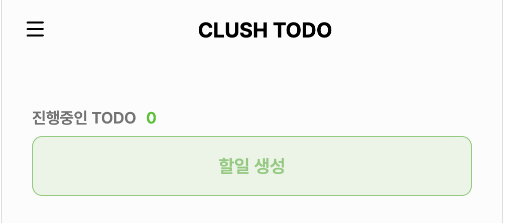

해당 버튼을 누르면 아래 사진과 같이 todo form이 생성됩니다.

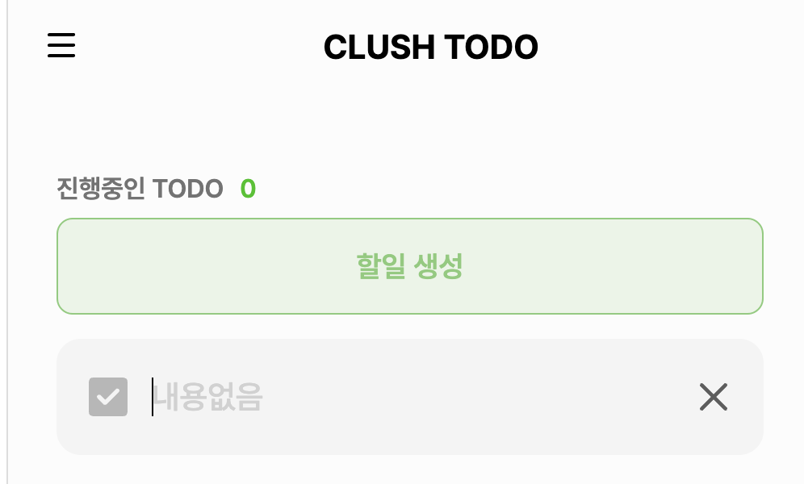

내용을 입력하고 enter키로 todo를 등록합니다. 또한 여러개 생성이 가능합니다.

**진행중인 todo 조회**

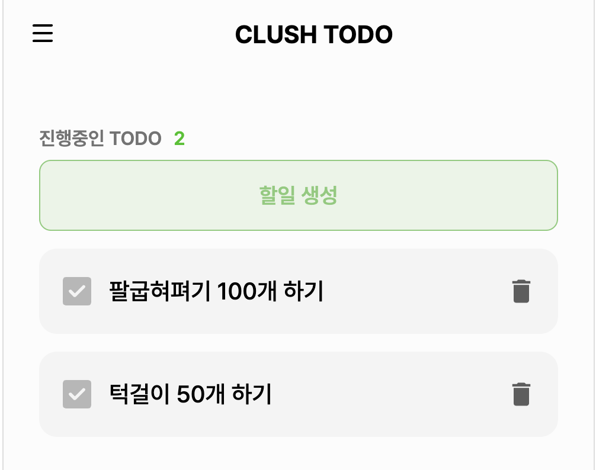

todo들을 등록한 순서대로 조회가 가능합니다.

**완료된 todo 조회**

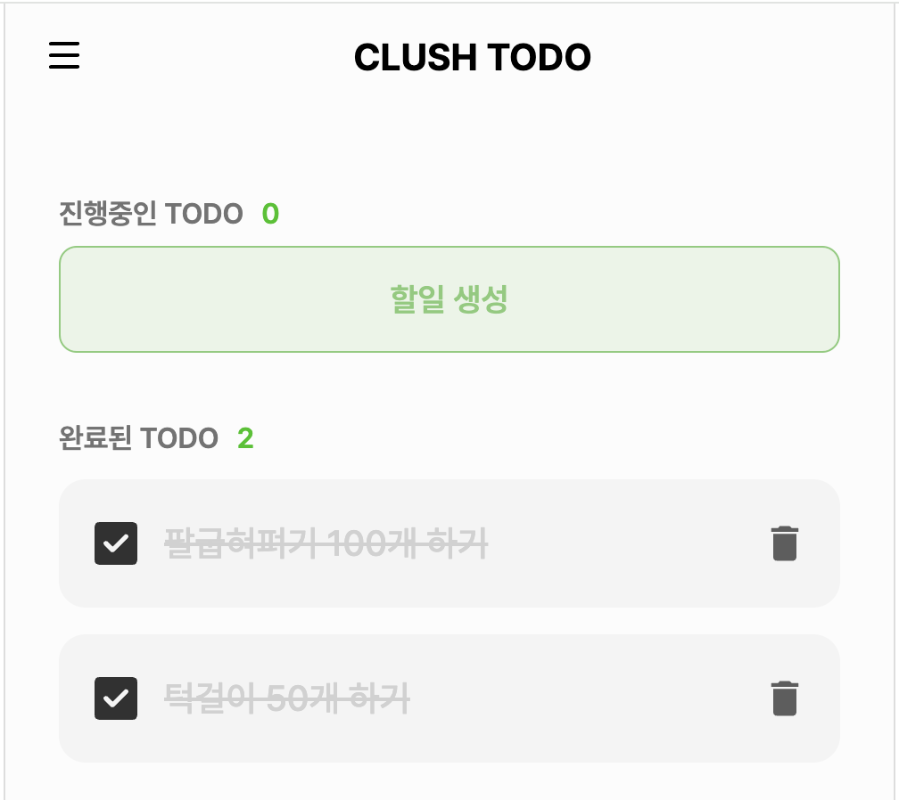

완료된 todo들 또한 등록한 순서대로 조회됩니다.

**휴지통 기능**

    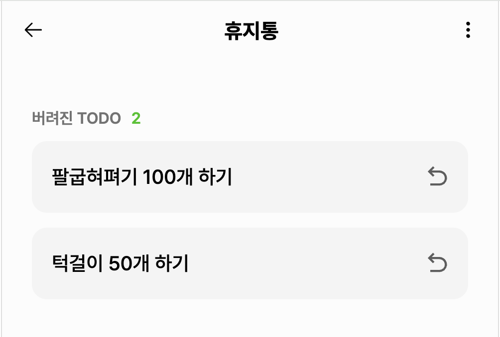
    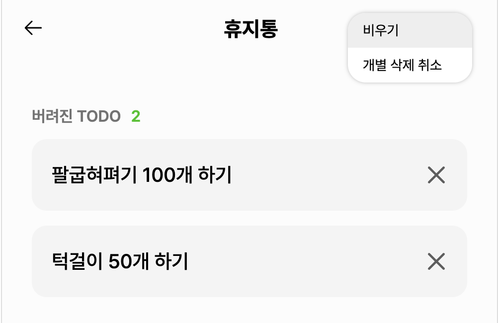

삭제한 진행, 완료 todo들을 휴지통에서 다시 조회가 가능합니다. 해당 기능은 todo를 잘못 삭제할 경우를 방지하기 위해 개발하였습니다. 휴지통에선 todo들을 전체, 개별삭제가 가능하며 비우기 기능을 제공합니다.

**todo 수정**

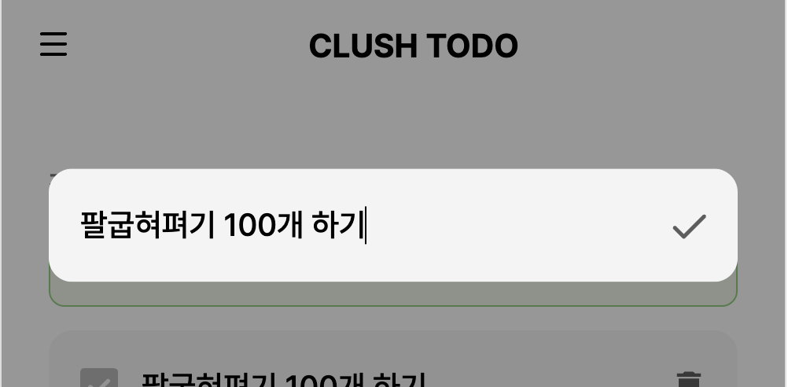

진행중인 TODO에서 todo를 수정할 수 있습니다.

## 2. 소스 빌드 및 실행 방법 메뉴얼

1. `https://github.com/Sanghyun0505/clush-todo.git`로 프로젝트를 `git clone`합니다.
2. IDE를 실행해 터미널에서 `npm install`로 node_modules를 받아 실행에 필요한 패키지를 다운로드 받습니다.
3. `npm start`로 프로젝트를 실행합니다.

## 3. 주력으로 사용한 컴포넌트에 대한 설명 및 사용 이유

저는 `/src/components/Todo/Card`에 위치한 `Card`컴포넌트를 구현하여 주력으로 사용하였습니다. CLUSH TODO에서 todo 조회, 수정, 등록 기능에 모두 공통적으로 필요하기에 하나의 컴포넌트로 구현하여 재사용성을 높히고자 사용하게 되었습니다.

또한, Compound Component 패턴을 적용하여 해당 기능들의 변경사항에 유동적으로 대응하도록 하였습니다. 그래서 아래 사진을 보시면 여러 형태로 커스텀해서 사용하고 있다는 것을 확인할 수 있습니다.

    

        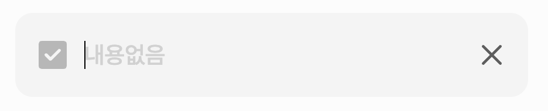
         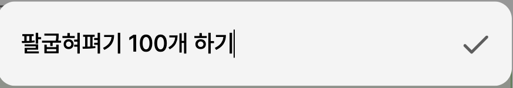
    

    

        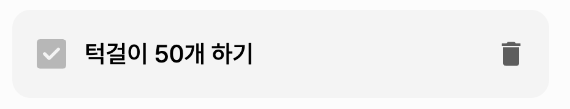
         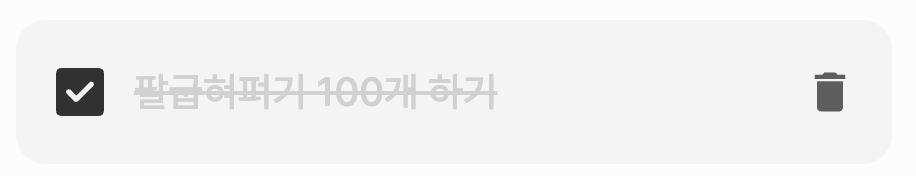
    

    

        
         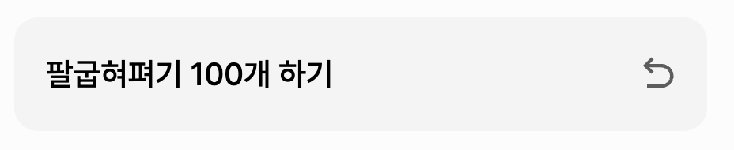
    

감사합니다.
